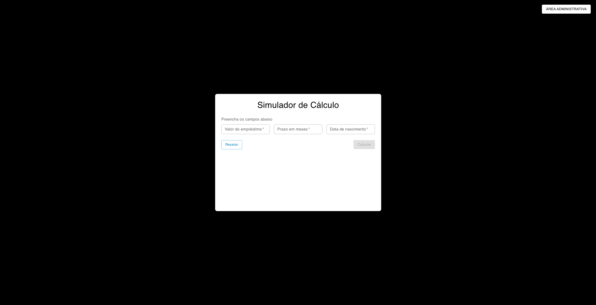

# Simulador de Empréstimos

[](https://codecov.io/gh/heitorluizp/simulador-emprestimo-teste-software)

## 1. Membros do Grupo

- Heitor Luiz
- Renato Silva Santos
- Caio Simões da Silva Ferreira

---

## 2. Explicação do Sistema

Este sistema é um simulador de empréstimos que permite ao usuário calcular o valor das parcelas, o valor total a ser pago, o total de juros, o prazo e a idade do solicitante a partir dos dados informados.

### Como funciona

### Simulação

- **Preenchimento dos dados:**  
   O usuário informa o valor do empréstimo, o prazo em meses e sua data de nascimento.
  

- **Validação:**  
  O sistema checa se os valores são válidos (por exemplo, se o valor do empréstimo e o prazo são maiores que zero e se a idade mínima é respeitada).

- **Cálculo:**  
  Com os dados preenchidos, o sistema:

  - Calcula a idade do usuário.
  - Define a taxa de juros de acordo com a idade, seguindo regras pré-definidas.
  - Usa a fórmula PMT (PMT significa "Payment" (pagamento, em inglês) e é uma sigla usada em finanças para indicar o valor fixo de cada parcela de um financiamento ou empréstimo com juros compostos.) para calcular o valor fixo das parcelas:
  - **PMT = PV × r / [1 - (1 + r)^-n]**
  - Onde:

    - **PMT** = valor da parcela
    - **PV** = valor do empréstimo
    - **r** = taxa de juros mensal
    - **n** = número de parcelas

    Assim, o usuário consegue saber exatamente quanto vai pagar em cada mês e quanto pagará ao final do empréstimo.

  - Mostra o valor total a ser pago, o total de juros, o valor de cada parcela e o prazo.
    

- **Tabela de amortização:**  
  O usuário pode abrir uma tabela detalhada que mostra, mês a mês, quanto está pagando de juros, quanto está amortizando e qual o saldo devedor após cada parcela.
  A tabela de amortização é um recurso que mostra, de forma detalhada, como a dívida do empréstimo diminui ao longo do tempo. Nela, o usuário pode visualizar mês a mês:
  - O número da parcela.
  - O valor pago em juros naquela parcela.
  - O valor efetivamente amortizado (abatido da dívida principal) em cada pagamento.
  - O saldo devedor restante após cada parcela.
    

### Área Administrativa

- **Acesso:**  
  No topo da tela principal, há um botão "Área Administrativa". Ao clicar, o usuário é direcionado para a tela de login do administrador.

- **Login:**  
  O administrador deve informar usuário e senha para acessar a área restrita.
  

- **Dashboard Administrativo:**  
  Após o login, o admin tem acesso a uma tela que exibe o histórico completo de todas as simulações realizadas no sistema, incluindo informações como valor do empréstimo, prazo, data de nascimento, valor total, valor das parcelas, total de juros, idade do solicitante e data/hora da simulação.
  

- **Logout e Navegação:**  
  O admin pode sair da área administrativa a qualquer momento usando o botão de logout, retornando para a tela de login. Também é possível voltar para a tela de simulação pelo botão "Voltar para Simulação".

Essas telas garantem que apenas usuários autorizados possam visualizar o histórico completo das simulações, trazendo mais segurança e organização para o sistema.

---

## 3. Tecnologias Utilizadas

- **Frontend**: React, Material UI, Vitest, React Testing Library, Day.js
- **Backend**: Node.js, Express, lowdb
- **Testes E2E**: Cypress
- **Ambiente**: Node.js e npm

---

## 4. Requisitos para rodar o projeto Localmente

- Node.js (versão 18 ou superior)
- npm (geralmente instalado junto com o Node.js)

---

## 5. Instruções para Rodar Localmente

1. **Clone o repositório:**

   ```sh
   git clone <URL_DO_REPOSITORIO>
   cd simulador-emprestimos
   ```

2. **Instale as dependências:**

   ```sh
   npm install
   ```

3. **Rode o sistema localmente:**

   ```sh
    npm run dev
   ```

   O sistema estará disponível em [http://localhost:5173/](http://localhost:5173/).

4. **Inicialize o servior**

    ```sh
    node server.js
    ```


---

## 6. Testes Automatizados

### Testes Unitários

- Existem testes unitários para funções e serviços principais do sistema, garantindo o correto funcionamento isolado de cada parte da lógica de negócio.

---

### Testes de Integração

- **`Simulador.test.jsx`**
  - Testa o preenchimento e cálculo do simulador, exibição de resultados, validação de campos e navegação para área administrativa.

- **`LoginPage.test.jsx`**
  - Testa login, mensagens de erro e navegação de volta para simulação.

- **`AdminDashboard.test.jsx`**
  - Testa a renderização do histórico, estatísticas e tabela de simulações no dashboard admin.

---

### Testes End-to-End (E2E) - Cypress

- **`regular_user_flow.cy.js`**
  - Simula o fluxo completo de um usuário comum: preenchimento dos campos, cálculo de múltiplos empréstimos, visualização dos resultados e abertura/fechamento da tabela de amortização.

- **`admin_flow.cy.js`**
  - Testa o fluxo de navegação entre a tela de simulação e a área administrativa, incluindo login, visualização do dashboard, logout e retorno para a tela de simulação.

- **`login_logout.cy.js`**
  - Testa o login e logout do administrador, garantindo que o acesso e a saída da área administrativa funcionam corretamente.

- **`full_flow.cy.js`**
  - Testa o fluxo completo: um usuário faz uma simulação e, em seguida, o admin acessa o dashboard e visualiza a simulação recém-criada.

---

**Como rodar os testes:**

- Testes unitários e de integração:
  ```sh
  npm test
  ```
- Testes E2E (Cypress):
  ```sh
  npx cypress open
  ```

---
